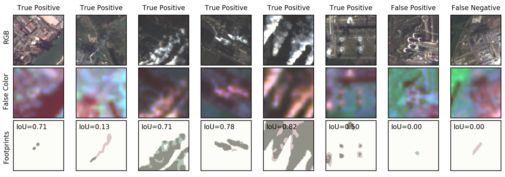

# Industrial Smoke Plume Detection

This repository contains the code base for our publication *Characterization of Industrial Smoke Plumes from
Remote Sensing Data*, presented at the *Tackling Climate Change with Machine
 Learning* workshop at NeurIPS 2020.

 
## About this Project

The major driver of global warming has been identified as the anthropogenic release
of greenhouse gas (GHG) emissions from industrial activities. The quantitative
monitoring of these emissions is mandatory to fully understand their effect on the
Earth’s climate and to enforce emission regulations on a large scale. In this work,
we investigate the possibility to detect and quantify industrial smoke plumes from
globally and freely available multiband image data from ESA’s Sentinel-2 satellites.
Using a modified ResNet-50, we can detect smoke plumes of different sizes with
an accuracy of 94.3%. The model correctly ignores natural clouds and focuses on
those imaging channels that are related to the spectral absorption from aerosols and
water vapor, enabling the localization of smoke. We exploit this localization ability
and train a U-Net segmentation model on a labeled subsample of our data, resulting
in an Intersection-over-Union (IoU) metric of 0.608 and an overall accuracy for
the detection of any smoke plume of 94.0%; on average, our model can reproduce
the area covered by smoke in an image to within 5.6%. The performance of our
model is mostly limited by occasional confusion with surface objects, the inability
to identify semi-transparent smoke, and human limitations to properly identify
smoke based on RGB-only images. Nevertheless, our results enable us to reliably
detect and qualitatively estimate the level of smoke activity in order to monitor
activity in industrial plants across the globe. Our data set and code base are publicly
available.

The full publication is available on arxiv.

The data set is available on [zenodo](http://doi.org/10.5281/zenodo.4250706).

## Content

`classification/`: Resnet-50 classifier code, training and evaluation
 routines
`segmentation/`: U-Net segmentation model code, training and evaluation
 routines

 
## How to Use

Download this repository as well as the 
[data](http://doi.org/10.5281/zenodo.4250706) and decompress the latter. For
both model training and evaluation, you will have to modify the directory
paths appropriately so that they point to the image and segmentation label
data.
   
It is expected that the data are split into separate data sets for training, 
validation, and evaluation. For our publication, this has been done in such a
way that all observations of a single location are contained in a 
single data set. Other strategies are possible and will be left to the user. 

Either model can be trained by invoking:

    python train.py
    
with the following optional parameters:
    
* `-bs <int>` to define a batch size,
* `-ep <int>` to define the number of training epochs,
* `-lr <float>` to define a starting learning rate, and
* `-mo <float>` to define a momentum value.

The models can be evaluated on the test data set by calling the corresponding
 `eval.py` script.
 
 
## Acknowledgements

If you use this code for your own project, please cite the following
conference contribution:

    Mommert, M., Sigel, M., Neuhausler, M., Scheibenreif, L., Borth, D.,
    "Characterization of Industrial Smoke Plumes from Remote Sensing Data",
    Tackling Climate Change with Machine Learning Workshop,
    NeurIPS 2020.
